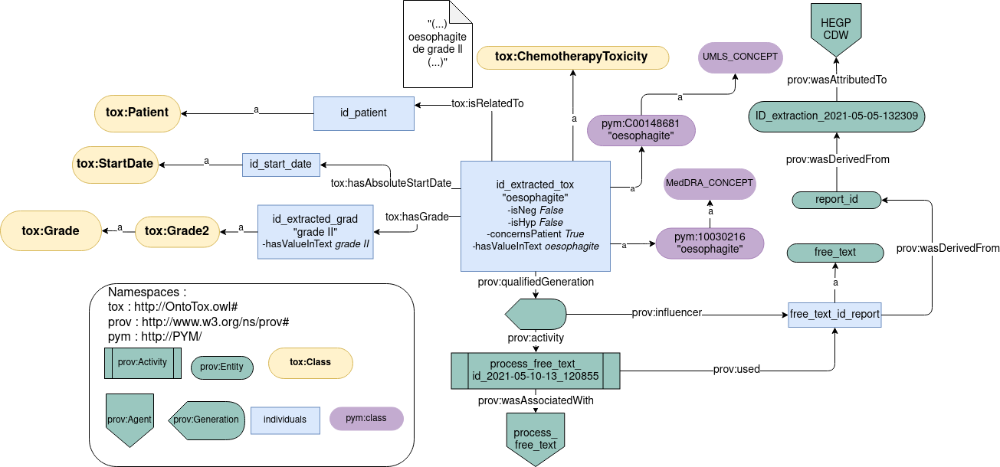
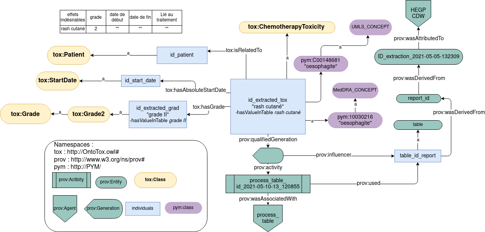
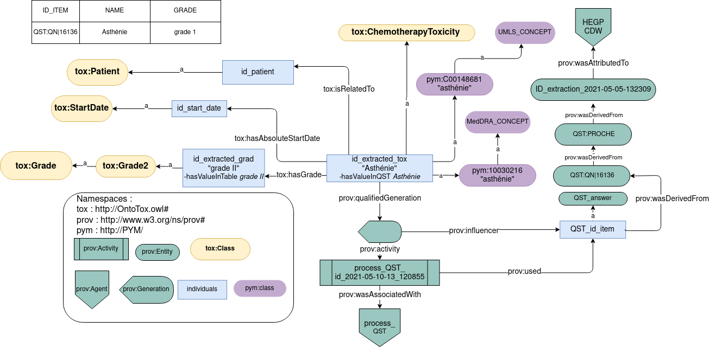

# OntoTox, an ontological representation of chemotherapy toxicities 

OntoTox is an ontology designed to represent chemotherapy toxicities, its attributes and provenance. 
OntoTox integrates toxicities and grading information extracted from three heterogeneous sources: 
- EHR  questionnaires
- semi-structured tables
- free text  

In this repository, you will find examples of OntoTox instanciations in the "owl_files" directory. These instanciations has been generated with false patient data, located in the "data" directory. 

PROV-O ontology [[1]](#1) has been instantiated to encode provenance.
OntoTox has been implemented in owl using Owlready2 module [[2]](#2).
Data has been processed using QuickUMLS [[3]](#3), Stanza [[4]](#4) and PyMedExt annotators [[5]](#5).

## OntoTox instanciations

### With free text

### With tables

### With questionnaires

## References

<a id="1">[1]</a> 
LEBO, Timothy, SAHOO, Satya, MCGUINNESS, Deborah, et al. Prov-o: The prov ontology. 2013.
https://www.w3.org/TR/prov-o/

<a id="2">[2]</a>
LAMY, Jean-Baptiste. Owlready: Ontology-oriented programming in Python with automatic classification and high level constructs for biomedical ontologies. Artificial intelligence in medicine, 2017, vol. 80, p. 11-28.
https://owlready2.readthedocs.io/en/v0.31/

<a id="3">[3]</a>
SOLDAINI, Luca et GOHARIAN, Nazli. Quickumls: a fast, unsupervised approach for medical concept extraction. In : MedIR workshop, sigir. 2016. p. 1-4.
https://github.com/Georgetown-IR-Lab/QuickUMLS

<a id="4">[4]</a>
QI, Peng, ZHANG, Yuhao, ZHANG, Yuhui, et al. Stanza: A Python natural language processing toolkit for many human languages. arXiv preprint arXiv:2003.07082, 2020.
https://github.com/stanfordnlp/stanza/tree/166e80e00254b1bf97961dc3462d043e0a0590c3

<a id="5">[5]</a>
DIGAN, William, NEURAZ, Antoine, et al. PyMedExt, un couteau suisse pour le traitement des textes médicaux.
https://github.com/equipe22/pymedext_core

